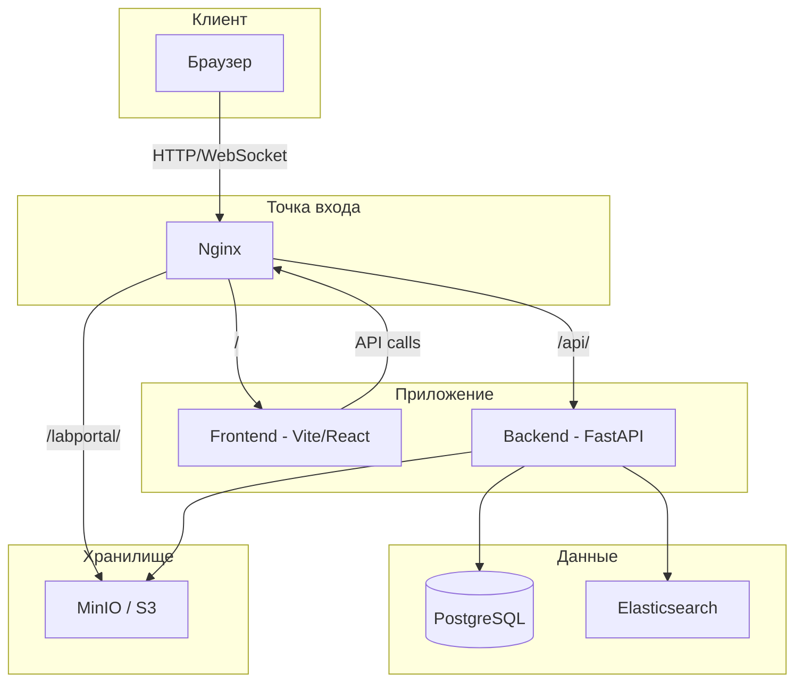
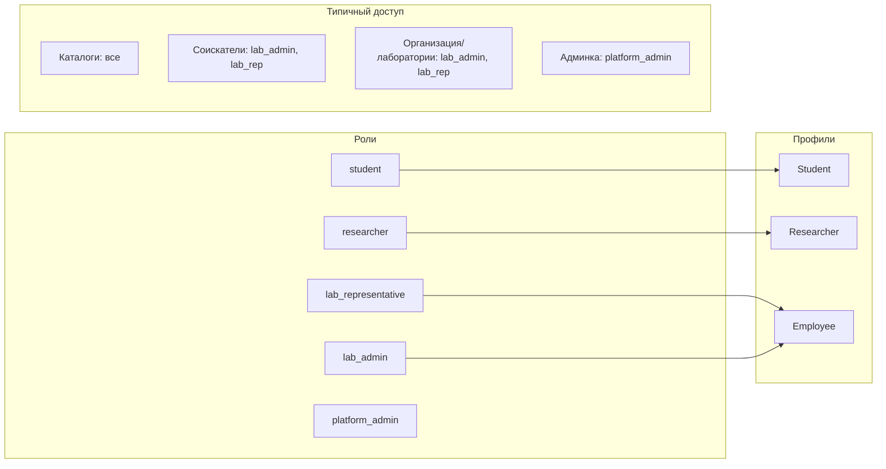
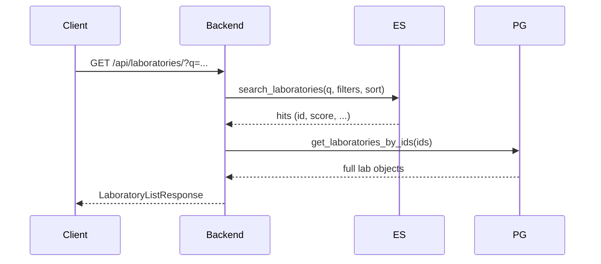

# Архитектура — Синтезум

Документ описывает высокоуровневую архитектуру платформы университетского технологического предпринимательства.

---

## Оглавление

1. [Обзор системы](#1-обзор-системы)
2. [Компоненты и сервисы](#2-компоненты-и-сервисы)
3. [Роли и домены](#3-роли-и-домены)
4. [Потоки данных](#4-потоки-данных)
5. [Аутентификация](#5-аутентификация)
6. [API и маршрутизация](#6-api-и-маршрутизация)
7. [Хранилище и медиа](#7-хранилище-и-медиа)
8. [Фоновые задачи](#8-фоновые-задачи)

---

## 1. Обзор системы



Nginx выступает reverse proxy: маршрутизирует запросы на frontend (SPA), backend (API) и MinIO (медиафайлы). Backend — единственный компонент, обращающийся к PostgreSQL, Elasticsearch и MinIO.

---

## 2. Компоненты и сервисы

| Компонент | Технологии | Назначение |
|-----------|------------|------------|
| **Frontend** | React, Vite, React Router v6 | SPA, каталоги, профили, админка |
| **Backend** | FastAPI, SQLAlchemy (async), Pydantic | API, бизнес-логика, валидация |
| **Nginx** | nginx | Reverse proxy, gzip, проксирование WebSocket (Vite HMR) |
| **PostgreSQL** | 16 | Основное хранилище данных |
| **Elasticsearch** | 8.11 | Поиск и ранжирование каталогов |
| **MinIO** | latest | S3-совместимое хранилище (аватары, документы) |

### Стек Docker Compose

```
nginx       → зависит от backend (healthy)
frontend    → зависит от backend
backend     → зависит от postgres, elasticsearch
postgres    → healthcheck pg_isready
elasticsearch → healthcheck cluster health
minio       → standalone
```

Все сервисы в одной сети `app-network`. Volumes: `postgres_data`, `elasticsearch_data`, `minio_data`.

---

## 3. Роли и домены



| Роль | Профиль | Основные возможности |
|------|---------|----------------------|
| **student** | Student | Поиск вакансий, отклики, профиль соискателя |
| **researcher** | Researcher | То же + заявки в лаборатории, профиль исследователя |
| **lab_representative** | Employee | Standalone-лаборатории, вакансии, запросы, заявки lab→org |
| **lab_admin** | Employee | Организация, лаборатории, сотрудники, вакансии, заявки, каталог соискателей |
| **platform_admin** | — | Админка: пользователи, подписки, модерация сущностей |

Подробнее: [ENTITIES.md](ENTITIES.md).

---

## 4. Потоки данных

### 4.1 Каталоги и Elasticsearch

Поиск и списки каталогов реализованы через Elasticsearch:

| Индекс | Сущности | Триггеры индексации |
|--------|----------|---------------------|
| `organizations` | Организации | publish, update org |
| `laboratories` | Лаборатории | publish, update lab, approve org_join |
| `vacancies` | Вакансии | publish, update vacancy |
| `queries` | Запросы | publish, update query |
| `applicants` | Соискатели (студенты, исследователи) | publish profile, update |

При старте backend проверяет индексы; если пусты — выполняет первичную индексацию из PostgreSQL. При изменении сущностей вызывается `reindex_*_by_ids`.

### 4.2 Ранжирование

Каталоги используют двухблочную сортировку:
1. **Платные** (paid_active) — по rank_score
2. **Бесплатные** — по rank_score

Ранжирование учитывает quality, freshness, performance, longevity. Подробнее: [subscription-ranking.md](subscription-ranking.md).

### 4.3 Диаграмма потока при поиске



PostgreSQL хранит полные объекты; Elasticsearch — только поля для поиска и сортировки. Порядок id из ES сохраняется при запросе к БД.

---

## 5. Аутентификация

### Схема

| Метод | Механизм |
|-------|----------|
| Email/пароль | Регистрация → верификация email → логин → JWT |
| ORCID | OAuth redirect → callback → JWT или дорегистрация (email + роль) |

### JWT

- Алгоритм: HS256
- Payload: `sub` (user_id), `exp`, `v` (token_version)
- `token_version` в users — для инвалидации всех сессий при смене пароля или блокировке

### Обработка на backend

- `get_current_user` — извлекает Bearer token, проверяет JWT, загружает User из БД
- `get_current_user_optional` — то же, но при отсутствии/невалидности возвращает None вместо 401

### Frontend

- Токен и user сохраняются в `localStorage` (labconnect_auth)
- Запросы: `Authorization: Bearer <token>`
- При 401 с токеном — очистка storage и редирект на логин

---

## 6. API и маршрутизация

### Структура

```
/api
├── /auth          — аутентификация
├── /users         — профиль пользователя
├── /roles         — справочник ролей
├── /search        — глобальный поиск
├── /home          — главная (featured, empty-suggestions)
├── /labs          — организации (создание, каталог)
├── /laboratories  — каталог лабораторий
├── /vacancies     — каталог вакансий
├── /queries       — каталог запросов
├── /applicants    — каталог соискателей
├── /profile       — профили, подписка, заявки, уведомления
├── /analytics     — события аналитики
├── /storage       — загрузка файлов
├── /stats         — счётчики платформы
└── /admin         — панель администратора
```

### Nginx

- `/` → Frontend (Vite dev или статика)
- `/api/` → Backend
- `/labportal/` → MinIO (публичные URL медиа)

Swagger/ReDoc отключены (`docs_url=None`). Документация API: [api-public.md](api-public.md), [admin-panel.md](admin-panel.md).

---

## 7. Хранилище и медиа

### MinIO (S3)

- Bucket: `labportal`
- Категории загрузки: equipment, laboratory, employee, organization, researcher, student, user
- Допустимые типы: изображения, PDF, DOC/XLS/PPT и др. (см. api-public)

### StorageUrlRewriteMiddleware

Подменяет URL вида `http://localhost:9000/labportal/...` на публичный (через S3_PUBLIC_BASE_URL), чтобы медиа были доступны при работе через туннель (ngrok и т.п.).

### Frontend

Фронтенд использует относительные пути `/api/`; Nginx проксирует их на backend. `BACKEND_URL` при сборке frontend задаёт API base для production.

---

## 8. Фоновые задачи

Backend использует APScheduler для cron-задач:

| Задача | Расписание | Описание |
|--------|------------|----------|
| `sync_openalex_data` | 03:00 UTC | Синхронизация данных OpenAlex |
| `check_subscription_expiry` | 04:00 UTC | Проверка истечения подписок |

---

## Связь с другими документами

| Документ | Содержание |
|----------|------------|
| [ENTITIES.md](ENTITIES.md) | Модель данных, сущности, связи |
| [subscription-ranking.md](subscription-ranking.md) | Подписки, ранжирование, формулы |
| [api-public.md](api-public.md) | Публичный API |
| [admin-panel.md](admin-panel.md) | Admin API и UI |
| [development.md](development.md) | Локальный запуск, БД, Elasticsearch |
