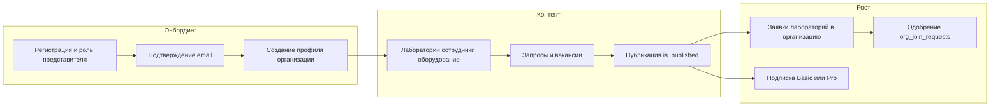
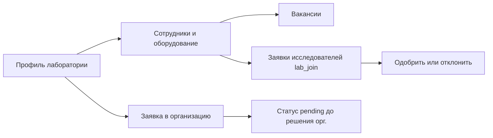
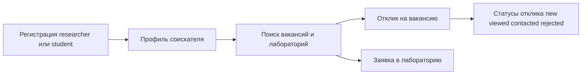

# Пользовательские сценарии, FAQ и модерация — Синтезум

Документ для саппорта, продукта и бизнеса. Соответствие домену — [ENTITIES.md](ENTITIES.md); админ-возможности — [admin-panel.md](admin-panel.md).

---

## 1. Journey: представитель организации

**Цель:** опубликовать организацию, запросы и вакансии; привлечь лаборатории и соискателей.

| Шаг | Что происходит в продукте | Сущности / заметки |
|-----|---------------------------|-------------------|
| Регистрация | Пользователь выбирает роль представителя | `users`, `roles` |
| Организация | Создаётся карточка вуза/НОЦ | `organizations` |
| Лаборатории | Внутри организации или отдельный контур creator | `laboratories_organizations` |
| Запрос | Описание задачи, бюджет, сроки, связь с лабами | `organization_queries` |
| Вакансия | Может ссылаться на лабораторию и запрос | `vacancies_organizations` |
| Публикация | Видимость в каталогах при `is_published` | Зависит от подписки — [subscription-ranking.md](subscription-ranking.md) |
| Вступление лаборатории | Заявка → одобрение представителем орг. | `org_join_requests` |
| Подписка | Заявка пользователя или ручная активация админом | `subscription_requests`, `user_subscriptions` |

---

## 2. Journey: представитель / владелец лаборатории (в т.ч. без организации)

**Цель:** заполнить карточку лаборатории, показать оборудование и людей, опубликовать вакансии, принять исследователей.

| Шаг | Описание | Сущности |
|-----|----------|----------|
| Карточка лаборатории | Название, описание, направления | `laboratories_organizations` |
| Связи | Сотрудники, оборудование, задачи | `employees`, `equipment`, `task_solutions` |
| Вступление в орг. | Лаборатория подаёт заявку | `org_join_requests` |
| Исследователь | Подаёт заявку в лабораторию | `lab_join_requests` |

**Ограничение при удалении:** перед удалением лаборатории могут требоваться действия по снятию с публикации связанных запросов и вакансий (сообщение в UI/API — проверять актуальные правила в коде).

---

## 3. Journey: исследователь / студент (соискатель)

**Цель:** найти вакансию или лабораторию, откликнуться, вести профиль.

| Шаг | Описание | Сущности |
|-----|----------|----------|
| Профиль | Резюме, интересы, публикации | `researchers` / `students` |
| Отклик | Один отклик на вакансию с пользователя | `vacancy_responses` |
| Заявка в лаб. | Ожидание решения представителя | `lab_join_requests` |

Статусы отклика на вакансию (для FAQ): `new`, `viewed`, `contacted`, `rejected` ([ENTITIES.md](ENTITIES.md)).

---

## 4. FAQ для пользователей

### Регистрация и доступ

- **Зачем подтверждать email?** Чтобы восстановить пароль и получать уведомления; это стандартная защита учётной записи.
- **Могу ли сменить роль?** Зависит от политики продукта; технически роль задаётся при регистрации и в админке. Уточнять у поддержки.
- **Меня заблокировали (`is_blocked`).** Только платформа: обратитесь в поддержку; администратор может разблокировать ([admin-panel.md](admin-panel.md)).

### Представители и подписки

- **Чем Basic отличается от Pro?** Лимиты на количество вакансий/запросов и самостоятельных лабораторий; у Pro — без этих лимитов и org-wide для лабораторий организации. Подробно: [business-pricing.md](business-pricing.md).
- **Как оплатить?** В текущей фазе — заявка на подписку и согласование с администратором платформы ([business-pricing.md](business-pricing.md)).
- **Почему моя карточка ниже в поиске?** Ранжирование учитывает заполненность профиля, «возраст» карточки, платный статус. Детали: [subscription-ranking.md](subscription-ranking.md).

### Публикация

- **Почему не вижу материал в каталоге?** Проверьте флаг публикации (`is_published`) у сущности; для части контента нужны права представителя.
- **Кто видит мои контакты?** Зависит от реализации экранов; персональные данные обрабатываются по политике сайта ([business-trust-ops.md](business-trust-ops.md)).

### Заявки

- **Сколько ждать рассмотрения заявки в лабораторию?** Решает представитель лаборатории; сроки не фиксируются платформой.
- **Заявка на вступление лаборатории в организацию** — рассматривает представитель организации (`org_join_requests`).

---

## 5. Политика модерации и публикации

Документ задаёт **рамку для саппорта и админов**; юридически обязательные формулировки — на сайте и в договоре с юристом.

### 5.1. Роль платформенного администратора

Пользователи с ролью `platform_admin` ([admin-panel.md](admin-panel.md)) могут:

- Просматривать и править организации, лаборатории, вакансии, запросы, оборудование, сотрудников, профили соискателей.
- Удалять записи при нарушении правил или по запросу уполномоченного лица (процедура внешнего запроса описывается внутренним регламентом).
- Блокировать пользователей, сбрасывать пароль через email, одобрять подписки и заявки на подписку.
- Работать с заявками на вступление (lab/org) через админ-эндпоинты, если это включено в процесс.

### 5.2. Принципы публикации

| Принцип | Практика |
|---------|----------|
| Законность | Запрещён контент, нарушающий закон РФ (экстремизм, персональные данные третьих лиц без оснований и т.д.). |
| Достоверность | Организации и лаборатории отвечают за правдивость описаний; платформа может снять публикацию при обоснованной жалобе. |
| Спам и дубли | Массовое создание пустых карточек, обход ранжирования пересозданием — противоречит правилам антигейминга ([subscription-ranking.md](subscription-ranking.md)). |
| Конфликт интересов | Спор о праве представлять организацию решается вне платформы или по запросу в поддержку с документами. |

### 5.3. Сроки и эскалации

- **SLA по модерации** не зафиксированы в коде: задать внутренне (например, ответ на жалобу до N рабочих дней) и дублировать в [business-trust-ops.md](business-trust-ops.md).
- **Отклонение заявки на подписку** — с указанием причины в поле `rejection_reason` (см. [ENTITIES.md](ENTITIES.md)).

---

## 6. Глоссарий терминов (RU) для маркетинга и продаж

Согласован с доменом [ENTITIES.md](ENTITIES.md). В публичных текстах использовать единообразно.

| Термин для внешних коммуникаций | Техническая сущность / примечание |
|--------------------------------|-----------------------------------|
| Организация | `organizations` — вуз, НОЦ, институт и т.п. |
| Лаборатория | `laboratories_organizations` — может быть в составе организации или самостоятельной |
| Запрос | `organization_queries` — потребность в решении задачи / поиске исполнителя |
| Вакансия | `vacancies_organizations` |
| Решение задачи (кейс) | `task_solutions_organizations` |
| Оборудование | `equipment_organizations` |
| Сотрудник (карточка) | `employees` |
| Подписка Basic / Pro | `user_subscriptions.tier` |
| Платное размещение | Платный блок в каталогах при `paid_active` — [subscription-ranking.md](subscription-ranking.md) |
| Отклик на вакансию | `vacancy_responses` |
| Заявка в лабораторию | `lab_join_requests` |
| Заявка лаборатории в организацию | `org_join_requests` |

---

## Связанные документы

- [business-one-pager.md](business-one-pager.md)
- [business-pricing.md](business-pricing.md)
- [business-trust-ops.md](business-trust-ops.md)
